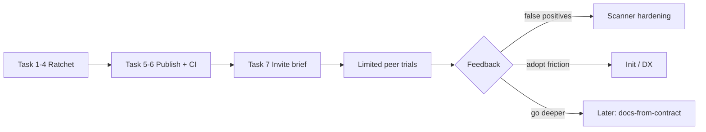

# Phase Next: Brownfield Ratchet → Publish → Limited Invite

> **For agentic workers:** REQUIRED SUB-SKILL: Use superpowers:subagent-driven-development (recommended) or superpowers:executing-plans to implement this plan task-by-task. Steps use checkbox (`- [ ]`) syntax for tracking.

**Goal:** Make Decree adoptable on messy real apps (ratchet/baseline), then ship a private npm package + one-command CI so technical design-system peers can try it — without expanding into docs/measurement yet.

**Architecture:** Keep the open `decree.contract.json` + shared `scanSource` path. Add a **baseline / max-new** layer in `verify` that compares current findings to a checked-in baseline (or caps *new* findings). Packaging is a thin publish of the existing CLI (`bin/decree.js`, `bin/decree-mcp.js`) with a documented GitHub Action / CI snippet. No Figma sync, no docs generator in this phase.

**Tech Stack:** Node 20+, existing `@babel/parser` scanners, `node:test`, npm private package `@stevendeeds/decree`, optional GitHub Actions workflow in-repo as a template.

**Phase outcome (definition of done):**
1. `decree verify --baseline` (or equivalent) can turn shadcn-dashboard / Radix playground from “wall of fail” into a controllable gate.
2. `@stevendeeds/decree` installable from GitHub Packages or npm (private) with `npx decree verify`.
3. Pressure gate still green; MUI official trial still **≤1** residual finding (theme hex) under absolute mode.
4. Written invite brief: who to invite, what to ask them to run, known limitations.

**Explicitly out of this phase:** docs-from-contract, measurement dashboards, Vue/Svelte, full CSS AST, competing with Deslint feature-for-feature.

---

## Why this phase (context)

POC prove-it is largely done: init / verify / MCP, AST JSX, profiles, excludes, pressure + pilots. Competitive critique said the wedge is real but adoption dies on **brownfield noise** and **unpublished package**. Next bets in order:

1. Ratchet / baseline  
2. Publish + CI template  
3. Limited technical invite (not public launch)

---

## File map (new / touched)

| Path | Responsibility |
|------|----------------|
| `src/verify/baseline.js` | Load/save baseline JSON; diff findings → new vs known |
| `src/verify/index.js` | Wire `--baseline` / `--write-baseline` / `--max-new` into `verifyPath` |
| `bin/decree.js` | CLI flags for ratchet modes |
| `src/verify/codes.js` | Optional `DECREE_BASELINE_REGRESSION` if we surface a summary code |
| `tests/baseline.test.js` | TDD for ratchet behavior |
| `fixtures/baseline-sample/` | Tiny fixture with known findings + baseline file |
| `.github/workflows/decree-verify.example.yml` | Copy-paste CI template |
| `docs/ADOPTION.md` | Brownfield + invite runbook |
| `package.json` | `files`, `bin`, version bump strategy, publishConfig |
| `scripts/run-pressure.mjs` | Assert ratchet mode on shadcn trial (optional gate) |

---

### Task 1: Spec the ratchet semantics (short design commit)

**Files:**
- Create: `docs/superpowers/specs/2026-08-06-brownfield-ratchet-design.md`

- [ ] **Step 1: Write the design** covering:
  - Baseline file format: `{ version: 1, findings: [{ code, file, line?, messageFingerprint }] }`
  - Fingerprint = hash of `code|file|normalizedMessage` (line optional — prefer without line so edits don’t thrash)
  - Modes:
    - default: absolute (today’s behavior)
    - `--baseline <path>`: fail only on findings **not** in baseline
    - `--write-baseline <path>`: write current findings as baseline (exit 0)
    - `--max-new <n>`: with or without baseline — fail if count of new findings > n
  - Exit codes: still 0 / 1 / 2; print `new` vs `baselined` counts
- [ ] **Step 2: Commit design**

```bash
git checkout -b cursor/phase-next-ratchet-f454
git add docs/superpowers/specs/2026-08-06-brownfield-ratchet-design.md
git commit -m "Spec brownfield baseline / max-new ratchet for decree verify"
```

---

### Task 2: Baseline fingerprint + diff (TDD)

**Files:**
- Create: `src/verify/baseline.js`
- Create: `tests/baseline.test.js`

- [ ] **Step 1: Write failing tests**

```js
// tests/baseline.test.js (sketch)
import { describe, it } from 'node:test';
import assert from 'node:assert/strict';
import { fingerprintFinding, diffAgainstBaseline } from '../src/verify/baseline.js';

it('same code+file+message → same fingerprint ignoring line', () => {
  const a = fingerprintFinding({ code: 'DECREE_HARDCODED_HEX', file: 'a.ts', line: 1, message: 'Hardcoded color #fff' });
  const b = fingerprintFinding({ code: 'DECREE_HARDCODED_HEX', file: 'a.ts', line: 99, message: 'Hardcoded color #fff' });
  assert.equal(a, b);
});

it('diff marks only unseen findings as new', () => {
  const baseline = { version: 1, findings: [{ fingerprint: 'x' }] };
  // build baseline entry from a finding, then add a second finding → one new
});
```

- [ ] **Step 2: Run tests — expect FAIL** (`node --test tests/baseline.test.js`)
- [ ] **Step 3: Implement `baseline.js`** — `fingerprintFinding`, `loadBaseline`, `writeBaseline`, `diffAgainstBaseline`
- [ ] **Step 4: Tests PASS**
- [ ] **Step 5: Commit**

```bash
git commit -m "Add baseline fingerprint and diff helpers for verify ratchet"
```

---

### Task 3: Wire CLI + verifyPath

**Files:**
- Modify: `src/verify/index.js`
- Modify: `bin/decree.js`
- Create: `fixtures/baseline-sample/` (contract + src with 2 planted findings + `decree.baseline.json` containing 1)

- [ ] **Step 1: Failing integration test** — verify with baseline containing one of two findings → exit 1 with exactly one “new” finding; `--write-baseline` then re-verify → exit 0
- [ ] **Step 2: Implement**
  - `verifyPath(target, { baselinePath, writeBaselinePath, maxNew })`
  - CLI: `decree verify [path] [--baseline file] [--write-baseline file] [--max-new N]`
  - stderr summary: `decree verify: N new, M baselined, K total`
- [ ] **Step 3: Absolute mode unchanged** — existing fixtures / pressure still pass
- [ ] **Step 4: Commit**

```bash
git commit -m "Wire decree verify --baseline and --max-new ratchet modes"
```

---

### Task 4: Prove ratchet on a noisy pilot (shadcn trial)

**Files:**
- Modify: `examples/trials/shadcn-dashboard-starter/` (add generated baseline under `_reports` or trial root — prefer `examples/trials/_reports/shadcn.baseline.json` so vendored app stays clean)
- Modify: `docs/TRIALS.md`, `docs/ADOPTION.md` (create)
- Modify: `scripts/run-pressure.mjs` — optional check: with baseline, shadcn new count === 0

- [ ] **Step 1:** `decree verify examples/trials/shadcn-dashboard-starter --write-baseline examples/trials/_reports/shadcn.baseline.json`
- [ ] **Step 2:** Confirm `--baseline` → exit 0
- [ ] **Step 3:** Plant one extra hex in a temp copy or test double → `--baseline` fails with 1 new
- [ ] **Step 4:** Document in `docs/ADOPTION.md`: “Day-1 write baseline; CI uses --baseline; fix new only”
- [ ] **Step 5:** Commit + open/merge PR for ratchet workstream

```bash
git commit -m "Baseline shadcn trial and document brownfield adoption"
```

**Success metric:** DS lead can put Decree on a 300+ finding app without blocking the whole org day one.

---

### Task 5: Publish packaging (private)

**Files:**
- Modify: `package.json` — `"files": ["bin","src","package.json","README.md"]`, engines, `publishConfig`
- Create: `.npmignore` if needed (exclude `examples/trials/**/node_modules`, fixtures ok to omit from package)
- Create: `docs/INSTALL.md` — GitHub Packages or npm private install
- Create: `.github/workflows/decree-verify.example.yml`

- [ ] **Step 1:** Decide channel: **GitHub Packages** for `@stevendeeds/decree` (private repo already) unless npm org is ready
- [ ] **Step 2:** Version `0.1.0` (first installable)
- [ ] **Step 3:** Dry-run `npm pack` — inspect tarball contents (CLI + src only; no trial apps)
- [ ] **Step 4:** Publish (manual / with user credentials — agent must not invent tokens)
- [ ] **Step 5:** From a temp dir: `npm i @stevendeeds/decree@0.1.0` → `npx decree verify <fixture path>`
- [ ] **Step 6:** Commit packaging docs + example workflow (publish step may be manual)

```bash
git commit -m "Prepare 0.1.0 package layout and CI install docs"
```

**Success metric:** Someone outside the monorepo clone can run Decree in ≤10 minutes.

---

### Task 6: CI template + pressure gate update

**Files:**
- `.github/workflows/decree-verify.example.yml`
- `scripts/run-pressure.mjs`
- `docs/PRESSURE.md` / `docs/ADOPTION.md`

- [ ] **Step 1:** Example workflow: checkout → setup node → install decree → `decree verify . --baseline decree.baseline.json`
- [ ] **Step 2:** Extend pressure script: absolute fixtures unchanged; add “shadcn baseline mode exit 0”
- [ ] **Step 3:** `npm run pressure` green on main
- [ ] **Step 4:** Commit

---

### Task 7: Limited invite brief (not marketing launch)

**Files:**
- Create: `docs/INVITE.md`

- [ ] **Step 1: Write invite brief** including:
  - Who: 2–3 design-system engineers (not general frontend)
  - What to run: install → init from their DS package → verify --write-baseline → CI with --baseline
  - Flagship story: MUI official example → 1 hex
  - Known limits: React/JSX-first; hex still partly line-based; MCP fail-open without agent hooks; noisy kitchensinks need baseline
  - Feedback ask: false positives, init gaps, would they require CI?
- [ ] **Step 2: Corvy DECREE issue** — “Phase next invite ready” with link to INVITE.md
- [ ] **Step 3: Commit; **do not** cold-email until ratchet + pack are merged

---

## Phase exit checklist

- [ ] Ratchet PR merged; shadcn trial green under `--baseline`
- [ ] `0.1.0` published (or GitHub Packages) and smoke-tested from clean install
- [ ] Example GH Action in repo
- [ ] `npm run pressure` PASS
- [ ] MUI trial still 1× `DECREE_HARDCODED_HEX` in absolute mode
- [ ] `docs/INVITE.md` reviewed by Steven before any outreach

---

## Sequencing diagram



---

## Risk notes

| Risk | Mitigation |
|------|------------|
| Baseline thrash if fingerprint includes line numbers | Fingerprint without line; document regenerating baseline |
| Teams treat baseline as permanent debt | ADOPTION.md: ratchet is temporary; burn down new=0 then shrink baseline |
| Publish leaks huge trial apps | `npm pack` audit; explicit `files` field |
| Invite before ratchet | Hard gate: no INVITE send until Task 4 merged |

---

## Immediate next action for the implementing agent

Start **Task 1** (design doc) on branch `cursor/phase-next-ratchet-f454`, then Task 2 TDD — do not start publish until ratchet green on shadcn trial.
